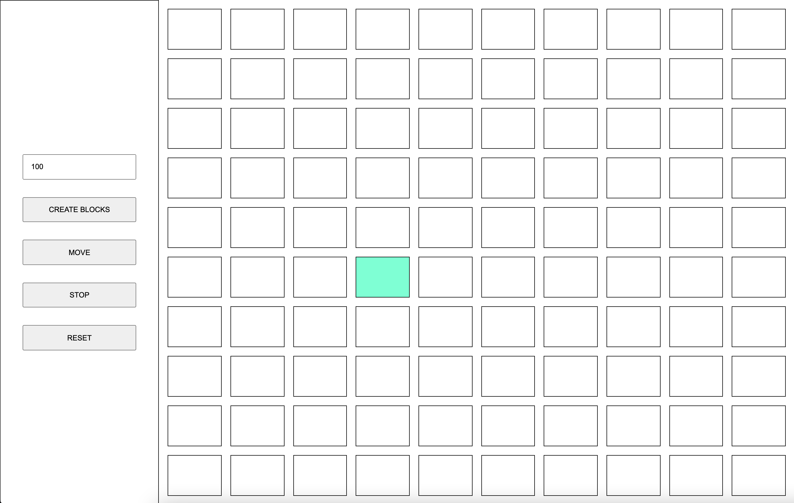

# block-color-animation

An animation that colors a set of blocks using HTML, CSS and Javascript

The application allows the user to create the amount of blocks to be colored. 

When the user clicks on the "Move" button, each block starting from the zero index will be filled with color until it reaches the last index. Then it will repeat the process until the colored block stop on the second to the last index. This continues until all blocks are colored in. 

After all blocks are colored in, the app will remove the colors in the same order. 

The "Stop" button will stop the function in it's place.

The "reset" button will reset the board so that the user may start again. 

